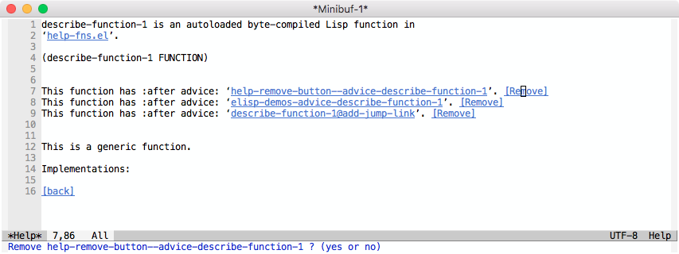
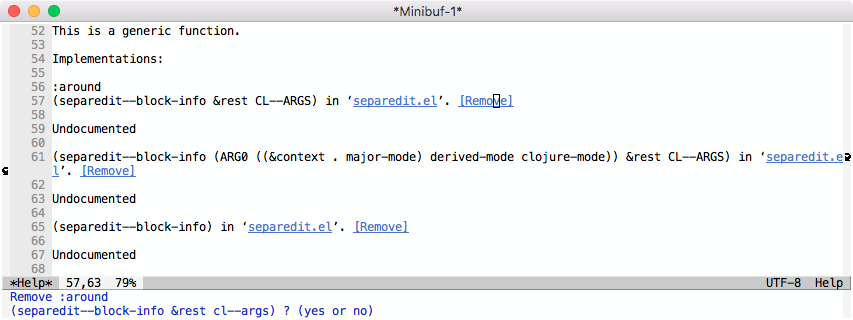

<!-- This file was generated from elisp commentary section by tool, DO NOT EDIT -->
<!-- Generated at: 2024-10-22 20:28:25 +0800 -->

# help-remove-button.el

Button for `*Help*` buffer to remove Advice / Generic method.





### Installation

* Manual

Clone this repository to `/path/to/help-remove-button/`.  Add the following to your configuration file:

``` elisp
(add-to-list 'load-path "/path/to/help-remove-button/")
(require 'help-remove-button)
```

* Quelpa

``` elisp
(quelpa '(help-remove-button :fetcher github
                             :repo "twlz0ne/help-remove-button.el"
                             :files ("help-remove-button.el")))
```
